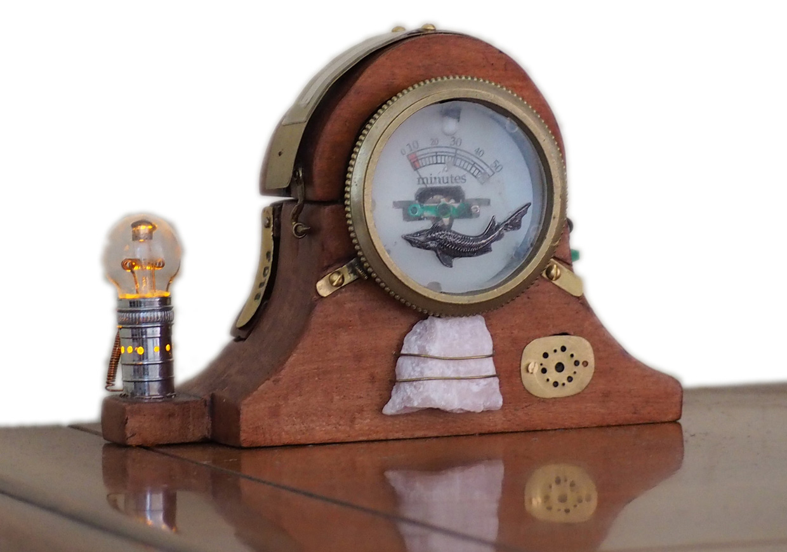

# Arditime
Arduino steampunk timer

## Usage
Pass your finger along the top of the clock: the Arditime machine will wake up and indicate the choosen duration of the timeout on the dial (in minutes).  

Then, two minutes before the timer expires, the stone will start to glow red.  
And when the timer expires, you will hear the sound of a gong.  
  
(During all the duration of the timer, the old amber lamp will light slowly.)  

## Credits
* Arduino **speaker_pcm** library by Michael Smith, for playing 8-bit PCM audio on pin 11 using pulse-width modulation (PWM).
* Windows **Wave2Code** application by JCS, which convert WAV audio files  into C code for inclusion in embedded systems projects. 
* **KiCAD** for electronic design (http://kicad-pcb.org/).
* **VeeCAD** for PCB design on veroboards (https://veecad.com/).

