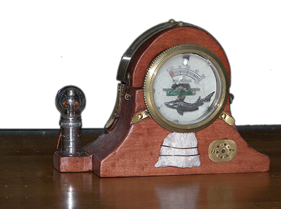

# Arditime machine

Arditime est un minuteur longue durée (2 à 60 minutes) qui émet une lumière rouge et un son de gong, à la fin de la minuterie.

Passer avec le doigt sur le contacteur tactile situé sur le dessus, et le faire glisser jusqu'à ce que l'aiguille indique le nombre de minutes souhaité.

-----

## Table des matières

1. Utilisation
2. [Principaux modules](pages/modules)
3. [Software](pages/software)
4. [Fabrication](pages/fabrication)
5. [Réalisation électronique](pages/electronique)
