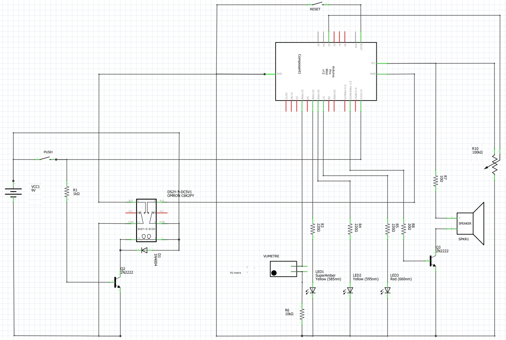
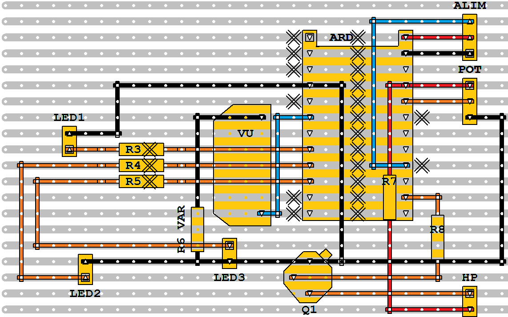
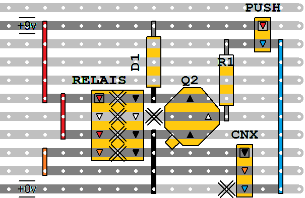

## Réalisation électronique

### Schéma

Le schéma (relativement simple) a été fait avec **[Fritzing](https://fritzing.org/)** .

------

## Printed Circuit Board (PCB) – Circuit imprimé

Pour la préparation des PCB sur des cartes VERIBOARD, le logiciel gratuit **[VeeCAD](https://veecad.com/)**  a été utilisé.

### Carte principale avec Arduino Mini Pro 5v

### Carte Auto-OFF

------

**[► Home](../index.md)**