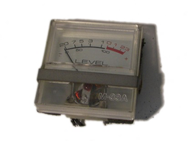
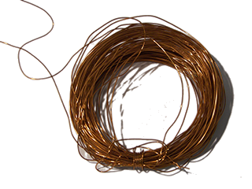
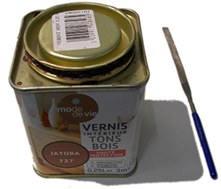
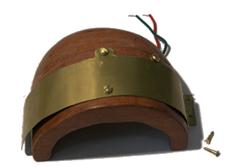

## Fabrication

### Boitier en bois

La forme particulière a été obtenue en sculptant des blocs de hêtre (quelques euros chez [Boesner](https://www.boesner.fr/)), et en utilisant des objets de récupération.

### Croquis préparatoires

------

**[► Home](../index.md)**