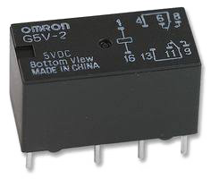
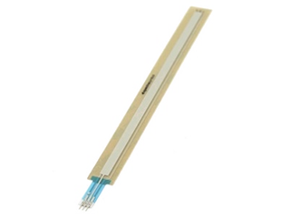
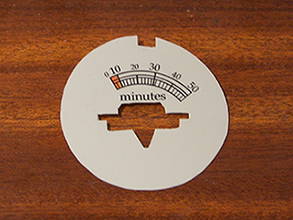
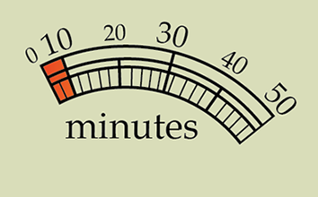

## Principaux modules

### Les LEDs

- La LED « Alarme » signale qu'on approche de la fin de la minuterie
- La LED ambre « déco » clignote irrégulièrement, à la façon d'une vieille lampe à vide.
- La LED ambre « vumètre » éclaire l'aiguille, et sa puissance augmente lorsque l'utilisateur modifie la valeur du timer.

_Les LED ont une luminosité de quelques Candela pour être bien visibles, même en plein jour (2 à 6 cd)._

### Les Timers

Cinq timers sont déclenchés lorsqu&#39;une durée de minuterie a été choisie :

- Timer vumètre : actualisation de la position de l&#39;aiguille toutes les 10 secondes
- Timeout Gong : le son est joué au terme de la minuterie
- Timeout FullLed : 20 secondes avant le gong, la LED Alarme (rouge) s&#39;allume plein feux.
- Timeout Alarme : 60 secondes avant le gong, la LED Alarme (rouge) s&#39;allume à moitié.
- Timeout Shutdown : 5 secondes après le gong, le système se met hors tension de lui-même.

### Le Gong

Ce son est un fichier MP3 converti en PCM (à l'aide d'utilitaire) et stocké en ROM. Comme on n'a que peu de ROM (32ko), ce fichier ne doit pas être gros: 3 ou 4 secondes max, à 8kb/s.

Il est ensuite joué par l'[Arduino](../ArduinoProMini-pinout.png), grâce à la librairie PCM sur un HP de 8Ω.

_Note : le haut-parleur de 0.8cm grésille dans les aigus : le son est de mauvaise qualité. Avec un haut-parleur de 2.4 cm, le son est meilleur, mais on a un problème de place pour l&#39;intégrer dans le support en bois._

### Module Auto-Off

Ce module a demandé le plus de travail: les exemples trouvés sur internet (par transistor, MOS ou relais) coupaient un des fils de l'alimentation (+5v ou 0v), mais la tension résiduelle sur la sortie de l'Arduino était suffisante pour réactiver le transistor, et donc l'alimentation de l'Arduino.

Au final, la solution qui fonctionne est un relais double (SPDT : Single Pole -&gt; Dual Throw) qui coupe à la fois le +5v et le 0v.

### Divers:

 On utilise un relais statique DPDT (Dual-Pole / Dual-Throw). La même bobine pilote deux relais. La documentation du relais est [ici](../HFD4_relay.pdf). Pour avoir un aperçu  des différents types de relais, voir [ici](https://www.astuces-pratiques.fr/electronique/le-relais-principe-de-fonctionnement).
  
 Capteur potentiomètre rectiligne 200mm: Ce capteur ultra-fin auto-collant est un potentiomètre dont la résistance varie (de 100 à 10000 ohms) en fonction de la position de votre doigt (lequel devra exercer une pression sur le capteur). Il est doté d"une sortie sur limande souple (de 2,5 cm de long) avec 3 connecteurs mâles soudables en bout. Largeur capteur: 200 mm. Largeur utile: 7 mm. Ref: P3380. (16€ chez [Lextronix](http://www.lextronic.fr/P3290-capteur-potentiometre-rectiligne-100-mm.html)).

Le cadran du minuteur a été fait sous Adobe Illustrator, avec les graduations en minutes.
 
 

### Notes

Pour des raisons pratiques, on a ajouté lors de la réalisation :
- un regard sur la LED « POWER » de  l"Arduino.
- deux pins accessibles (RESET et GND) qui permettent de réinitialiser le montage en cas de freeze, en les touchant avec un objet métallique.

------

**[► Home](../index.md)**