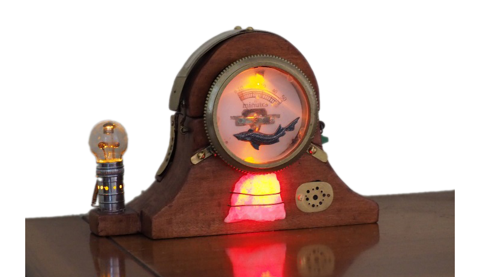

## La partie logicielle

### Librairies

On utilise la librairie `SimpleTimer` pour gérer les Timeouts (gong, alarme, auto-off, etc) et les timers périodiques pour l'allumage progressif des LEDs par exemple, via les sorties en PWM de l'Arduino.  

La librairie `Speaker_PCM` sert à jouer un fichier audio sur la sortie `D11` de l'Arduino (qui est associée au `Timer1` (16-bits cadencé à 8kHz). A noter que cela bloque le PWM sur les sorties 3 et 10 de l'Arduino. Elle utilise aussi le **Timer2** (8-bit) pour la modulation des impulsions. Ceci bloque le PWM (`analogWrite()`) sur les pins Arduino 11 et 3. Le fichier audio doit être en unsigned bytes (8-bit), 8kHz, mono, et suffisamment court pour tenir dans la mémoire flash.

### Préparation

Le fichier audio a besoin d'être préparé.

- Convertir le MP3 en WAV (8-bits, mono, 8kHz) avec **[Audacity](https://audacity.fr)**
- Puis convertir ce WAV en fichier .h avec l'utilitaire **[WaveToCode](http://ccgi.cjseymour.plus.com/wavtocode/wavtocode.htm)**.

-----

**[► Home](../index.md)**