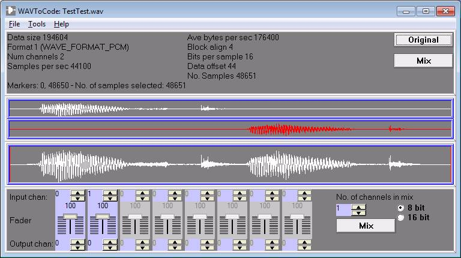

# Wave2Code

Cet utilitaire transforme un fichier **WAV** en un fichier **C**.

## Description

[Application website](http://ccgi.cjseymour.plus.com/wavtocode/wavtocode.htm)

[Wave2Code on softpedia]https://www.softpedia.com/get/Multimedia/Audio/Other-AUDIO-Tools/WAVToCode.shtml)

This application enables you to read **WAV audio files** and convert them into **C code** for inclusion in embedded systems projects. 
I wrote it for an embedded processor project of mine where I wanted to get sound data from my PC, 
but in a data format suitable for an embedded processor to send to a DAC, that could be included in a C compiler. 
Having failed to find an existing application suitable for my requirement, I decided to write my own.

[API documentaton ](wav2code.pdf)

## Supported WAVE file formats: 

* WAVE_FORMAT_PCM
* Extended PCM format KSDATAFORMAT_SUBTYPE_PCM

Number of input channels: 1-8

Bits per sample: 8, 16, 24

Mix output: 1 or 2 channels, 8 or 16 bit

## C format: 

* Interleaved / Separate arrays
* Signed / unsigned

